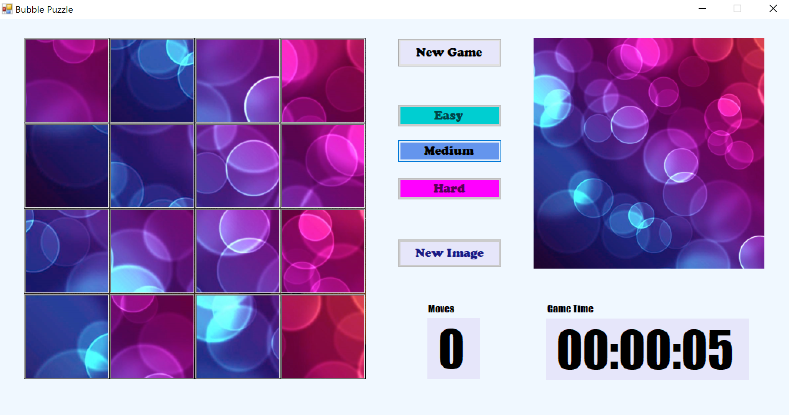

# *Проектна задача по предметот Визуелно Програмирање*

# 

# *Неделчева Сандра - 173097*

# Опис на апликацијата – Bubble Puzzle

Како проект по предметот Визуелно програмирање изработена e апликација од типот
сложувалка (Bubble Puzzle), во која се има за цел составување на слика според
избор на играчот. Избраната слика најпрвин се дели на помали делови, при што
секој дел од сликата представува една коцка од сложувалката. Потоа коцките се
мешаат користејки функција за случаeн избор на броеви, со што сложувалката е
разместена и играчот може да започне со нејзино решавање.

Решувањето на сложувалката се прави преку избор и кликање на делови од мозаикот
на сложувалката, при што при избор на било кои две коцки, нивните места взаемно
се заменуваат, се до потполно решување на сложувалката и постигнување на
изгледот на почетната слика, прикажана во десниот горен дел од екранот.

Процесот на разместување на сложувалката се одвива во три тежински нивоа, во
зависност од избраната комплексност од страна на играчот (Easy, Medium, Hard), и
притоа почетната слика се дели на 4 (Easy), 16 (Medium) или 25 (Hard) делови.

  

>   Easy Medium Hard

Времето поминато во решување на сложувалката се регистрира на приказот за време,
при што истовремено се регистира и бројот на потези кои ги направил играчот во
процесот на решувањето.

Степенот на решеност на сложувалката постојано се проверува, и доколку се утврди
дека истата е целосно решена, играта завршува и се прикажува поминатото време и
бројот на потези кои ги направил играчот.

За време на една игра, играчот има избор да прекине со постоечката игра и
отпочне нова, при што ќе има избор на нова слика, како и ново ниво на
комплексност, кое ќе проба да го реши во новата игра. За потреби на играта
однапред се селектирани и поставени тематски слики соодветни на името на
апликацијата - Bubble Puzzle.

# Опис на решението

Апликацијата е развиена во околината Visual Studio 2019, како Windows Form врз
која се поставени следните елементи:

-   gbPuzzle, gbImage – GroupBox

-   btnEasy, btnMedium, btnHard – Button за менување на нивото на комлексноста

-   btnAddImage, btn Reset – Button за избор на слика и отпочнување нова игра

-   lblTimer, lblMoves – Label за прикажување на истеченото време и бројот на
    чекори

Тематските слики кои ги користи сложувалката се сместени во делот Resources на
проектот, и истите се дел од дистрибуција на самата апликација, со цел да бидат
расположиви на играчот веднаш по инсталацијата на апликацијата.

Покрај ова, играчот има опција да избере слика по свој вкус, од локалниот диск,
која ќе ја користи за време на играта. На сликата подолу е прикажан почетниот
екран.

Играта започнува со избор на слика која ќе се искористи за креирање на
сложувалката. За ова се користи стандардната алатка OpenFileDialog која се
повикува при кликање на копчето New Image. Притоа се прикажува дијалогот за
избор на датотека од локалниот диск, при што корисникот може да избере една од
понудените слики.

Избраната слика се прикажува преку креирање на PicturBox елементи во соодветните
GroupBox рамки на главната форма. Притоа заради различниот размер на сликите,
истата соодветно се процесира преку функцијата ProcessImage, која користи методи
од стандардната Graphics библиотека и сликата ја димензионира според зададениот
простор.

Преку кликање на едно од копчињата Easy, Medium, Hard се избира начинот на кој
кје се дели изворната слика. Во тој процес се креира низа од класата Images, во
која ќе се сместат сите поединечни делови добиени со делење на сликата. Процесот
на делење на сликата го врши функцијата SliceImage. Истовремено, се креира и
низа од PictureBox објекти кои соодветно се позиционираат во gbPuzzle елементот.

Пред да се распореди секоја од сликите во еден од PictureBox елементите, се
прави низа од рандомизирани индекси по случаен избор (Random), која се користи
за измешано расподелување на сликите во PictureBox објектите, и со тоа
разместување на сложувалката.

Разместувањето на сложувалката, се регистрира во низа од Point објекти,
Locations [], која ја чува точната конечна локација на секое делче од сликата, и
истата се користи за проверка дали сложувалката е целосно решена.

Проверката за целосна решеност на сложувалката се извршува при секој
последователен потез на играчот, односно секогаш кога два дела од сликата
взаемно си ги заменат местата. При конечно точно решение на целата сложувалка,
се повикува фунцијата Win, so што застанува времето на игра, и се активира
дијалог преку MessageBox објект, кој го известува корисникот за успешен крај на
играта, каде со кликање на OK се отпочнува нова игра.

# 

# 
